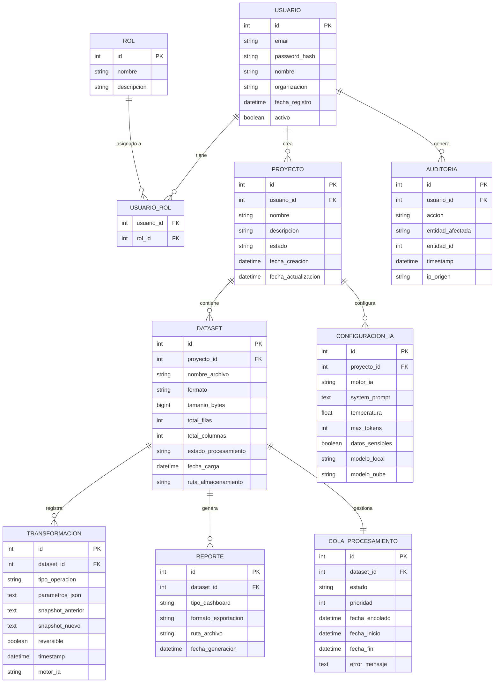
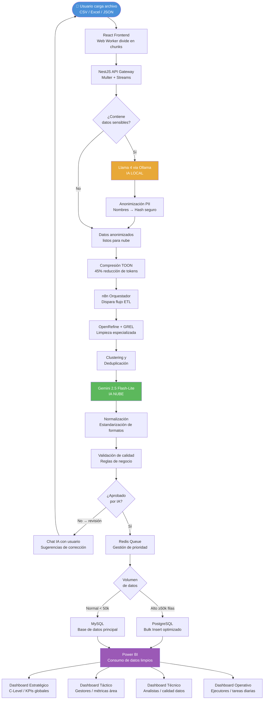
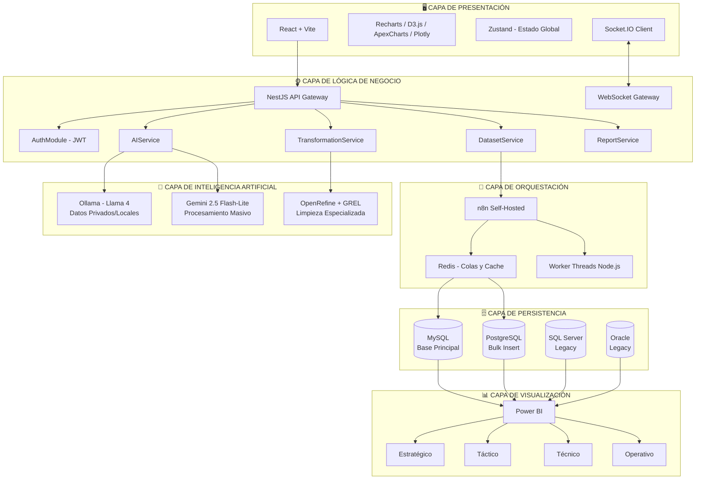
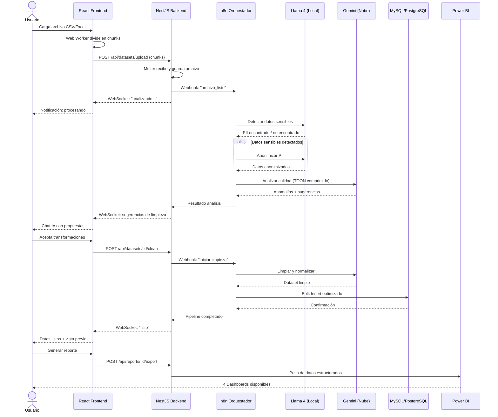
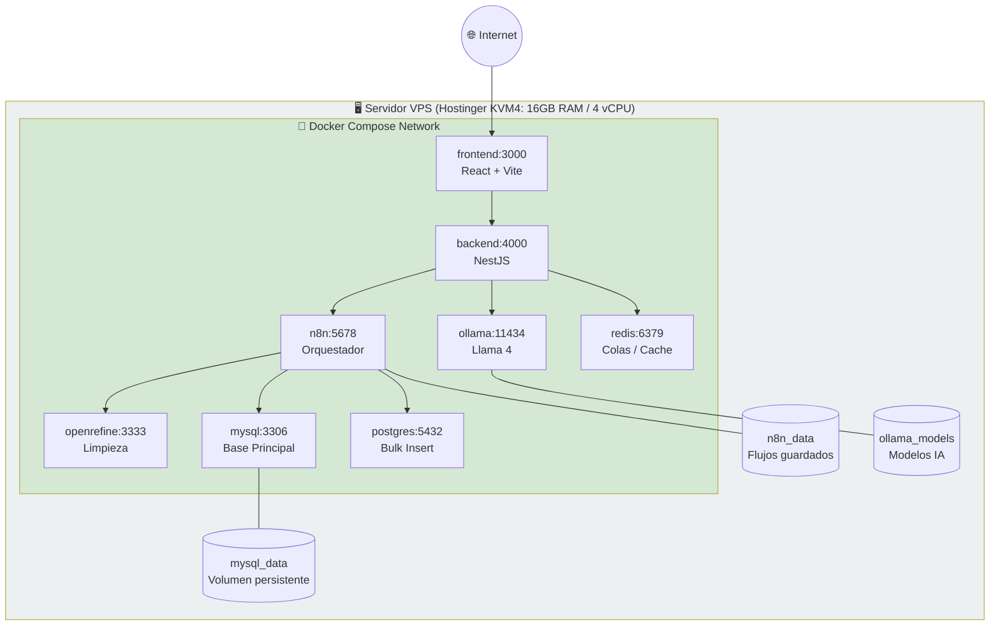
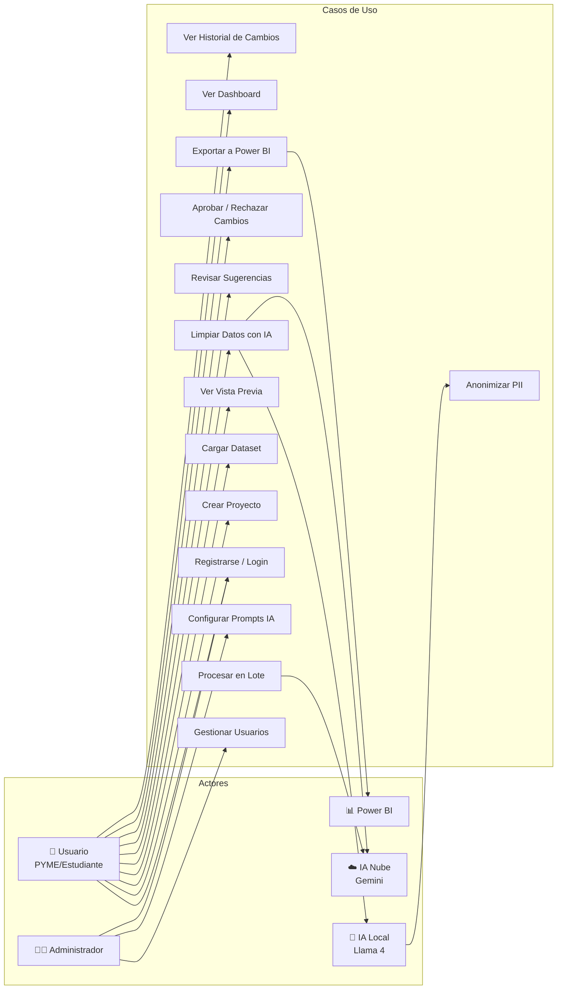

# DIAGRAMAS — Representaciones Visuales del Sistema

> Todos los diagramas están escritos en sintaxis **Mermaid** y pueden renderizarse en Obsidian (con el plugin Mermaid activado), GitHub, o cualquier visor compatible.

---

## 1. Diagrama Entidad-Relación (ER)

Representa el modelo de datos central del sistema IA-DataFlow Hub.

---

## 2. Flujo de Proceso ETL Completo

Representa el pipeline principal de datos desde la carga hasta la visualización.

---

## 3. Arquitectura de Capas del Sistema

---

## 4. Diagrama de Secuencia — Flujo de Carga y Análisis

---

## 5. Diagrama de Privacidad — Flujo Ley 1581

```mermaid
flowchart LR
    INPUT[📂 Datos del usuario] --> DETECT{Detección\nde PII}

    DETECT -- Contiene PII\nnombres / docs / correos --> LOCAL[🔒 Procesamiento LOCAL\nLlama 4 en servidor propio]
    LOCAL --> ANON[Anonimización\nPII → Hash seguro]
    ANON --> MAPEO[(Mapa de\nanomización\nencriptado)]
    ANON --> SAFE[Datos sin PII]

    DETECT -- Sin datos sensibles --> SAFE

    SAFE --> TOON[Compresión TOON\n45% menos tokens]
    TOON --> CLOUD[☁️ Gemini 2.5 Flash-Lite\nSolo datos públicos]
    CLOUD --> RESULT[Resultado procesado]

    RESULT --> RECONSTRUCT{¿Requiere\ndatos originales?}
    RECONSTRUCT -- Sí --> MAPEO
    MAPEO --> RESTORE[Restaurar PII\npara reporte interno]
    RECONSTRUCT -- No --> FINAL[📊 Reporte / Dashboard\nDatos anonimizados]
    RESTORE --> FINAL

    style LOCAL fill:#E74C3C,color:#fff
    style CLOUD fill:#3498DB,color:#fff
    style MAPEO fill:#F39C12,color:#fff
```

---

## 6. Diagrama de Infraestructura — Docker Compose

---

## 7. Diagrama de Casos de Uso

