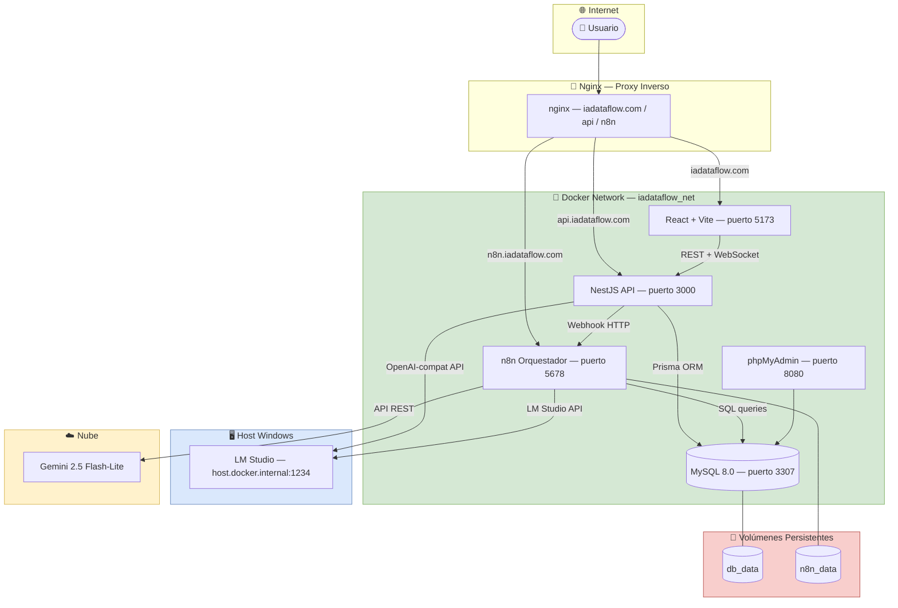

# Diagrama 1 — Arquitectura General del Sistema

**Qué muestra:** Todos los servicios del sistema y cómo se comunican entre sí dentro de la red Docker `iadataflow_net`.

**Última actualización:** 2026-05-12

---

---

## Notas de implementación

| Servicio | Imagen | Puerto externo | Puerto interno |
|---|---|---|---|
| Frontend | `iadataflow/client:latest` | 5173 | 80 |
| API NestJS | `iadataflow/api:latest` | 3000 | 3000 |
| MySQL | `mysql:8.0` | 3307 | 3306 |
| n8n | `n8nio/n8n:latest` | 5678 | 5678 |
| phpMyAdmin | `phpmyadmin:latest` | 8080 | 80 |
| LM Studio | Host Windows | 1234 | — |

- Puerto MySQL externo es **3307** porque el 3306 está ocupado por la instalación local del host.
- LM Studio corre en el host Windows y es accesible desde Docker vía `host.docker.internal`.
- Nginx no está activo en desarrollo local; cada servicio es directamente accesible por su puerto.

---

## Documentos relacionados

**Docs:** [[ARQUITECTURA]] · [[DOCKERIZACION]] · [[DOCUMENTACION_TECNICA]]
**Apps:** [[api]] · [[client]] · [[mailer-service]]
**Paquetes:** [[database]]
**HUs:** [[✅ HU 014 - Arquitectura Base y Monorepo|HU-014]] · [[✅ HU 036 - Estructura Base del API NestJS|HU-036]] · [[✅ HU 013 - Configuración de Infraestructura de Datos (Docker)|HU-013]]
