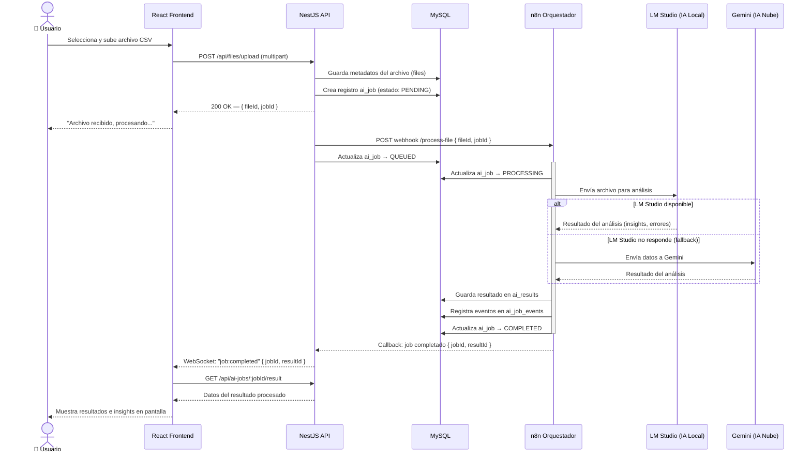

# Diagrama 2 — Flujo de Procesamiento de un Archivo con IA

**Qué muestra:** El recorrido completo desde que el usuario sube un archivo CSV hasta que recibe el resultado procesado por IA en pantalla.

**Última actualización:** 2026-05-12

---



---

## Flujo de estados del AI Job

```
PENDING → QUEUED → PROCESSING → COMPLETED
                       ↓
                     FAILED → (reintento automático) → PROCESSING
                       ↓
                   CANCELLED
```

## Notas

- El fallback a **Gemini** ocurre automáticamente si LM Studio no responde en el timeout configurado.
- El frontend se actualiza en tiempo real vía **WebSocket** (Socket.IO); no requiere polling.
- Todos los estados quedan registrados en `ai_job_events` para auditoría y trazabilidad.
- Los datos sensibles (PII) deben procesarse **únicamente** en LM Studio (local); nunca se envían a Gemini sin anonimización previa.
