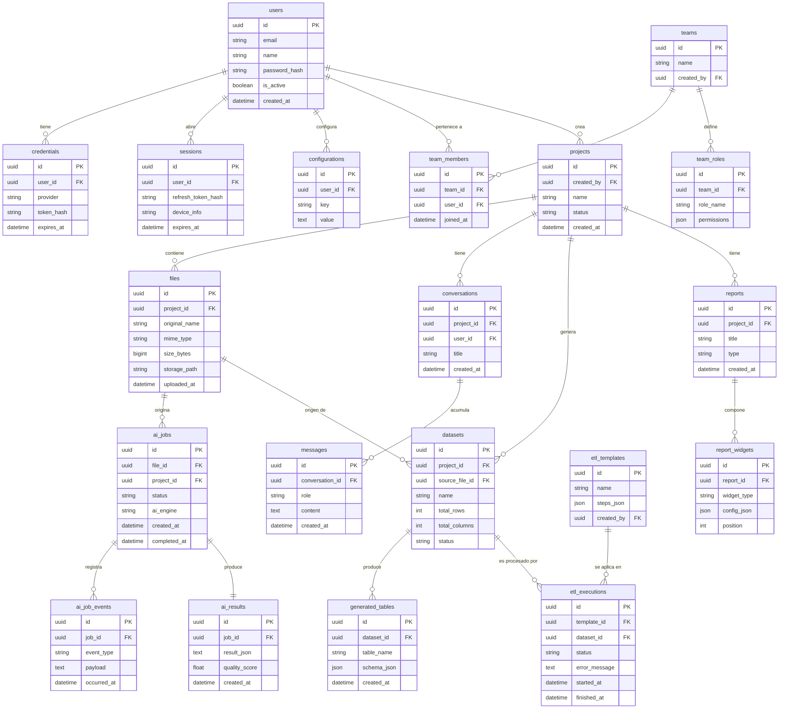

# Diagrama 3 — Modelo de Base de Datos (Entidades Principales)

**Qué muestra:** Las tablas más importantes del sistema y sus relaciones. Versión simplificada: solo se muestran las columnas clave, no todas las columnas de cada tabla.

**Última actualización:** 2026-05-12

---

---

## Grupos de entidades

| Grupo | Tablas |
|---|---|
| Identidad | `users`, `credentials`, `sessions`, `configurations` |
| Equipos | `teams`, `team_members`, `team_roles` |
| Proyectos | `projects`, `files`, `conversations`, `messages` |
| IA | `ai_jobs`, `ai_job_events`, `ai_results` |
| Datos | `datasets`, `generated_tables` |
| ETL | `etl_templates`, `etl_executions` |
| Reportes | `reports`, `report_widgets` |

## Notas

- Todos los IDs son **UUID v4** (HU-030 — migración de INT a UUID).
- Las eliminaciones son lógicas mediante `deleted_at` (soft delete) según HU-017.
- El campo `status` en `ai_jobs` sigue el ciclo: `PENDING → QUEUED → PROCESSING → COMPLETED / FAILED / CANCELLED`.

---

## Documentos relacionados

**Docs:** [[DOCUMENTACION_TECNICA]] · [[ARQUITECTURA]]
**Paquetes:** [[database]]
**HUs:** [[✅ HU 011 - Diseño y Creación de la Base de Datos Relacional (MySQL)|HU-011]] · [[✅ HU 012 - Implementación del Esquema con Prisma ORM|HU-012]] · [[✅ HU 016 - Reemplazar ENUMs con Tablas|HU-016]] · [[✅ HU 030 - Migración Estratégica de IDs Enteros a UUID|HU-030]]
