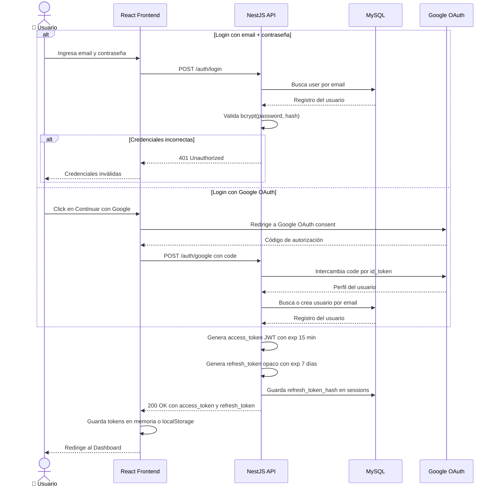
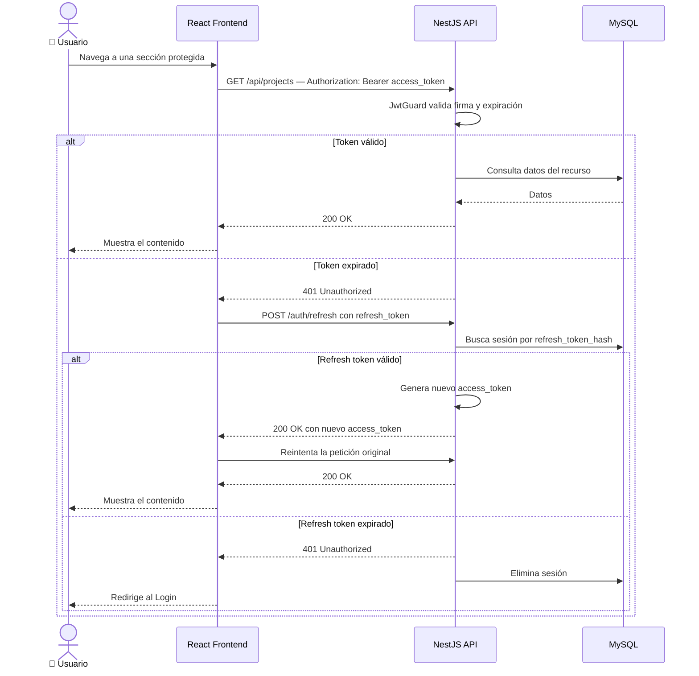

# Diagrama 4 — Flujo de Autenticación

**Qué muestra:** Cómo un usuario inicia sesión (credenciales o Google OAuth), obtiene tokens JWT y cómo el API los valida en cada petición protegida.

**Última actualización:** 2026-05-12

---

## 4a — Login y emisión de tokens

---

## 4b — Petición autenticada con JWT

---

## Resumen de tokens

| Token | Tipo | Duración | Almacenamiento | Uso |
|---|---|---|---|---|
| `access_token` | JWT firmado HS256 | 15 minutos | Memoria del frontend | Cada petición a la API |
| `refresh_token` | Opaco — hash en DB | 7 días | `sessions` table | Renovar el access_token |

## Notas

- El `JWT_SECRET` se define en `.env` y nunca se expone en logs ni respuestas.
- Cada sesión activa tiene una fila en `sessions`; el logout la elimina, invalidando el refresh_token.
- El guard `JwtGuard` de NestJS intercepta todas las rutas marcadas con `@UseGuards(JwtGuard)`.
- Si el usuario tiene múltiples dispositivos, cada uno tiene su propia fila en `sessions` (HU-024).
