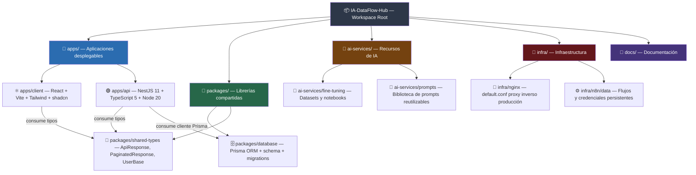
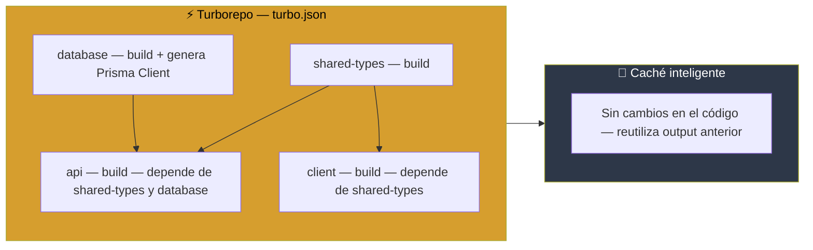
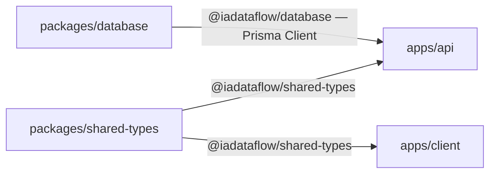

# Diagrama 8 — Estructura del Monorepo

**Qué muestra:** Cómo está organizado el monorepo con Turborepo, qué contiene cada workspace, el orden de build y las dependencias entre paquetes.

**Última actualización:** 2026-05-12

---

## 8a — Árbol de directorios y responsabilidades

---

## 8b — Pipeline de build con Turborepo

---

## 8c — Dependencias entre workspaces

---

## Comandos clave

| Comando | Qué hace |
|---|---|
| `npm install` | Instala dependencias de todos los workspaces |
| `npm run dev` | Levanta API (NestJS watch) + Client (Vite HMR) en paralelo |
| `npm run build` | Compila todos los workspaces respetando el orden de dependencias |
| `npx prisma migrate dev` | Crea una nueva migración desde `packages/database/` |
| `npx prisma studio` | Abre UI visual de la base de datos |
| `docker-compose up --build` | Construye imágenes propias y levanta todos los servicios |

## Notas

- `packages/shared-types` no tiene dependencias internas — es la base de la cadena.
- `packages/database` genera el cliente Prisma en tiempo de build; la API lo importa como librería.
- Turborepo cachea los outputs por contenido de archivos, no por timestamps.
- Los directorios `infra/n8n/data/` y `infra/nginx/` no son workspaces — son configuración estática.

---

## Documentos relacionados

**Docs:** [[ARQUITECTURA]] · [[DOCKERIZACION]] · [[ESTRUCTURA]]
**HUs:** [[✅ HU 014 - Arquitectura Base y Monorepo|HU-014]] · [[✅ HU 036 - Estructura Base del API NestJS|HU-036]]
