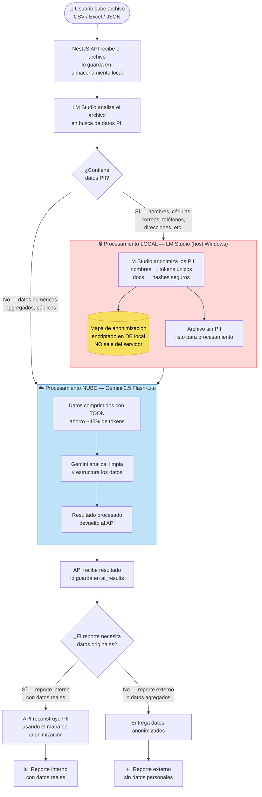
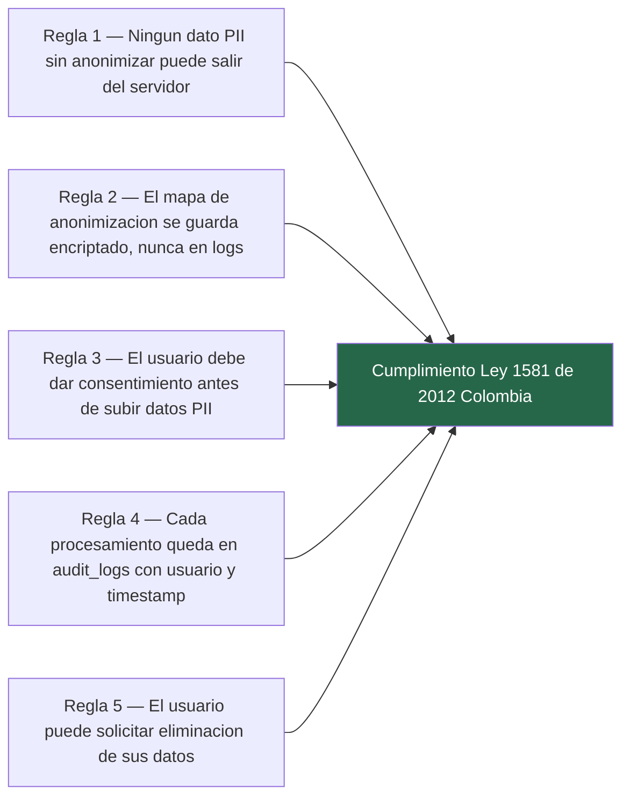

# Diagrama 9 — Privacidad y Cumplimiento Ley 1581

**Qué muestra:** Cómo el sistema decide qué datos pueden salir a la nube y cuáles deben procesarse localmente, garantizando el cumplimiento de la Ley 1581 de protección de datos personales de Colombia.

**Última actualización:** 2026-05-12

---

## 9a — Flujo de decisión: local vs nube

---

## 9b — Clasificación de datos PII vs seguros

```mermaid
graph LR
    subgraph PII["Datos PII — Solo procesamiento LOCAL"]
        P1["Nombres completos"]
        P2["Numeros de cedula o pasaporte"]
        P3["Correos electronicos"]
        P4["Numeros de telefono"]
        P5["Direcciones fisicas"]
        P6["Numeros de tarjeta o cuenta"]
        P7["Datos de salud"]
    end

    subgraph SAFE["Datos seguros — Pueden ir a la Nube"]
        S1["Cifras numericas y estadisticas"]
        S2["Fechas sin contexto personal"]
        S3["Categorias y etiquetas"]
        S4["Totales y agregados"]
        S5["Metricas de negocio"]
    end

    PII -->|anonimizar primero| SAFE
    SAFE -->|TOON compress| CLOUD(("Gemini"))

    style PII fill:#FED7D7,stroke:#E53E3E
    style SAFE fill:#C6F6D5,stroke:#276749
    style CLOUD fill:#BEE3F8,stroke:#2B6CB0
```

---

## 9c — Reglas de negocio (Ley 1581)

---

## Notas de implementación

| Componente | Responsabilidad en la Ley 1581 |
|---|---|
| **LM Studio (local)** | Único que toca datos PII sin procesar; nunca expuesto a internet |
| **Mapa de anonimización** | Guardado en `configurations` table con cifrado AES-256 |
| **Gemini API** | Solo recibe datos ya anonimizados o no-PII |
| **audit_logs** | Registra toda operación con datos: quién, cuándo, qué archivo, qué IA |
| **Consentimiento** | Capturado en frontend antes del primer upload; guardado en `configurations` |

- La decisión de routing (local vs nube) la toma **LM Studio en la primera pasada** del archivo.
- Si LM Studio no está disponible, el sistema **bloquea el procesamiento** — nunca hace fallback a Gemini con datos PII sin revisar.
