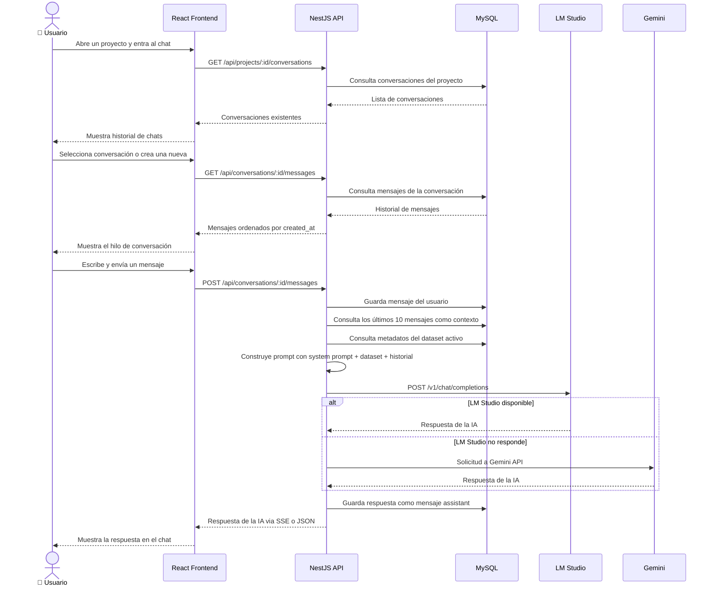
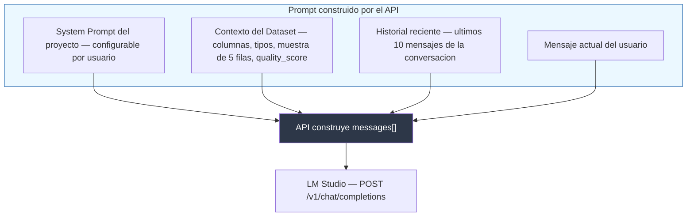
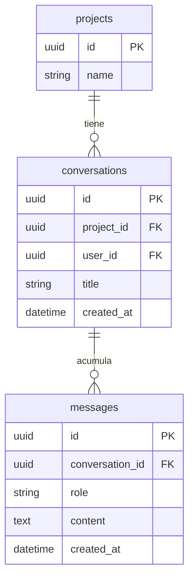
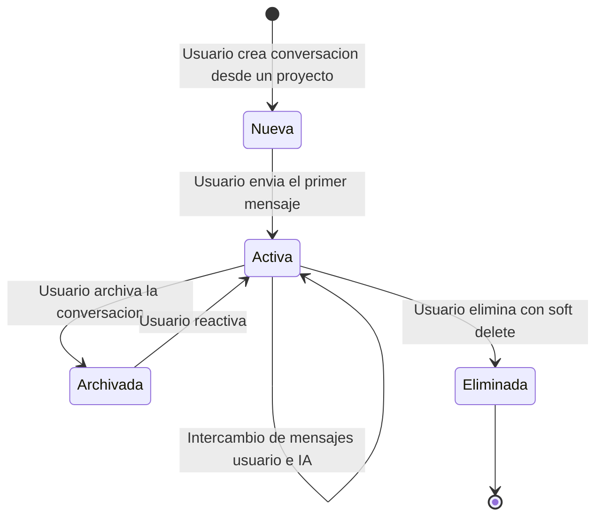

# Diagrama 10 — Flujo de Conversaciones y Chat con IA

**Qué muestra:** Cómo funciona el sistema de chat contextual: cómo el usuario interactúa con la IA dentro de un proyecto, cómo se mantiene el historial de mensajes, y cómo la IA usa el contexto del dataset activo para responder.

**Última actualización:** 2026-05-12

---

## 10a — Secuencia de un mensaje en el chat

---

## 10b — Estructura del prompt enviado a la IA

---

## 10c — Modelo de datos de conversaciones

---

## 10d — Ciclo de vida de una conversación

---

## Notas de implementación

| Aspecto | Detalle |
|---|---|
| **Contexto de mensajes** | Se envían los últimos **10 mensajes** para no exceder el context window del modelo |
| **System prompt** | Configurable por proyecto en `configurations` table con key `ai_system_prompt` |
| **Contexto del dataset** | Solo metadatos, no el CSV completo, para eficiencia de tokens |
| **Streaming** | El API puede devolver respuesta en **Server-Sent Events (SSE)** para efecto typewriter |
| **Fallback** | Si LM Studio falla, se usa Gemini solo si el dataset activo no tiene PII |
| **Eliminación** | Soft delete — los mensajes se marcan con `deleted_at`, no se borran físicamente |

- Cada conversación pertenece a un **proyecto**, no a un archivo específico.
- El `role` del mensaje sigue el estándar OpenAI: `"user"` / `"assistant"` / `"system"`.
