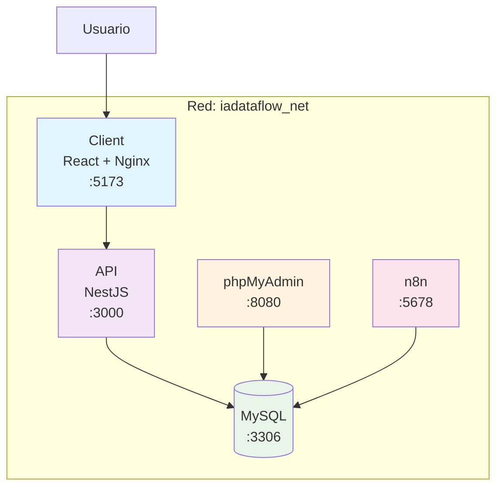
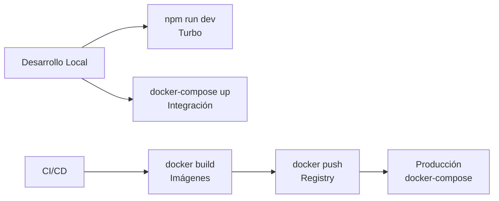

# 🐳 Dockerización del Proyecto IA-DataFlow-Hub

**Participantes:**

- Juan Diego Mejia Maestre
- David Ospina


**Objetivo:** Implementar una infraestructura Docker completa para el desarrollo y despliegue del monorepo IA-DataFlow-Hub.

## 🎯 Visión General de la Dockerización

  

El proyecto **IA-DataFlow-Hub** utiliza una arquitectura de microservicios orquestada con **Docker Compose**, permitiendo el desarrollo local consistente y el despliegue en producción de manera reproducible.

  

### Servicios Implementados

  
| Servicio         | Stack Tecnológico    | Puerto (Host:Container) | Descripción                    |
| :--------------- | :------------------- | :---------------------- | :----------------------------- |
| **`client`**     | React + Vite + Nginx | `5173:80`               | Interfaz de usuario (Frontend) |
| **`api`**        | NestJS (Node.js)     | `3000:3000`             | Core Business Logic (Backend)  |
| **`db`**         | MySQL 8.0            | `3307:3306`             | Capa de persistencia principal |
| **`phpmyadmin`** | phpMyAdmin           | `8080:80`               | GUI para administración de BD  |
| **`n8n`**        | n8n Workflow         | `5678:5678`             | Motor de automatización        |

  

---

  

## 🏗️ Arquitectura Docker

  
![[Pasted image 20260508201350.png]]
### Estructura de Contenedores

  



  

### Red y Comunicación

  

- **Red interna:** `iadataflow_net` (bridge driver)

- **Comunicación:** Servicios se comunican por nombre de contenedor

- **Puertos expuestos:** Solo los necesarios para acceso externo

- **Volúmenes:** Persistencia de datos de MySQL y n8n

  

---

  

## 📦 Dockerfiles Optimizados

  

### Frontend (apps/client/Dockerfile)

  

```dockerfile

# Multi-stage build: builder → runtime

FROM node:20-alpine AS builder

# ... build process

  

FROM nginx:alpine AS runtime

# ... serve static files

```

  

**Características:**

- ✅ Multi-stage build para imagen mínima

- ✅ Health check integrado

- ✅ Nginx optimizado para SPA

  

### Backend (apps/api/Dockerfile)

  

```dockerfile

# Tres stages: deps → builder → runtime

FROM node:20-alpine AS deps

# ... production deps only

  

FROM node:20-alpine AS builder

# ... TypeScript compilation

  

FROM node:20-alpine AS runtime

# ... minimal runtime image

```

  

**Características:**

- ✅ Tres stages para caché óptimo

- ✅ Usuario no-root por seguridad

- ✅ Health check con wget

- ✅ Solo dependencias de producción

  

---

  

## ⚙️ Docker Compose Configuration

  

### Servicios Principales

  

#### Client Service

```yaml

client:

  build:

    context: .

    dockerfile: apps/client/Dockerfile

  ports:

    - "5173:80"

  healthcheck:

    test: ["CMD-SHELL", "curl -fs http://localhost:80"]

```

  

#### API Service

```yaml

api:

  build:

    context: .

    dockerfile: apps/api/Dockerfile

  environment:

    - DATABASE_URL=mysql://root:${DB_PASSWORD}@db:3306/${DB_NAME}

  depends_on:

    db:

      condition: service_healthy

```

  

#### Base de Datos

```yaml

db:

  image: mysql:8.0

  healthcheck:

    test: ["CMD", "mysqladmin", "ping", "-h", "localhost"]

  volumes:

    - db_data:/var/lib/mysql

```

  

---

  

## 🔧 Mejores Prácticas Implementadas

  

### 1. **Multi-Stage Builds**

- Separación clara entre build y runtime

- Imágenes finales mínimas

- Mejor caché de layers

  

### 2. **Health Checks**

- Verificación automática del estado de servicios

- Reinicio automático en caso de fallos

- Dependencias condicionales (`depends_on.service_healthy`)

  

### 3. **Seguridad**

- Usuario no-root en contenedores Node.js

- Variables de entorno para credenciales

- Exposición mínima de puertos

  

### 4. **Persistencia**

- Volúmenes nombrados para datos críticos

- Configuración persistente de n8n

- Datos de MySQL preservados entre reinicios

  

### 5. **Optimización de Build**

- `.dockerignore` para excluir archivos innecesarios

- Contexto de build desde raíz para acceso a packages

- Cache eficiente de dependencias npm

  

---

  

## 🚀 Comandos de Uso

  

### Desarrollo Local

  

```bash

# Construir y levantar todos los servicios

docker-compose up --build

  

# Solo servicios específicos

docker-compose up client api

  

# Con logs detallados

docker-compose up --build -d && docker-compose logs -f

```

  

### Producción

  

```bash

# Build optimizado para producción

docker-compose -f docker-compose.yml up --build -d

  

# Verificar estado de servicios

docker-compose ps

  

# Ver logs de un servicio específico

docker-compose logs api

```

  

### Mantenimiento

  

```bash

# Reiniciar un servicio

docker-compose restart api

  

# Limpiar contenedores detenidos

docker-compose down

  

# Limpiar también volúmenes (⚠️ pierde datos)

docker-compose down -v

```

  

---

  

## 🔍 Troubleshooting

  

### Problemas Comunes

  

#### Puerto ya en uso

```bash

# Ver qué proceso usa el puerto

netstat -ano | findstr :5173

  

# Cambiar puerto en docker-compose.yml

ports:

  - "5174:80"  # Cambiar host port

```

  

#### Error de conexión a BD

```bash

# Verificar variables de entorno

docker-compose exec api env | grep DATABASE

  

# Verificar MySQL logs

docker-compose logs db

```

  

#### Build lento

- Verificar `.dockerignore`

- Usar `docker build --no-cache` si es necesario

- Optimizar orden de COPY en Dockerfile

  

---

  

## 📊 Métricas y Monitoreo

  

### Health Checks Configurados

  

| Servicio | Comando | Intervalo | Timeout |
| :--- | :--- | :--- | :--- |
| **client** | `curl -fs http://localhost:80` | 30s | 5s |
| **api** | `wget -q --spider http://localhost:3000` | 30s | 5s |
| **db** | `mysqladmin ping` | 10s | 5s |

  

### 📈 Uso Real de Recursos (Estado Actual)

  

**Resumen General:**

- **CPU Total:** 0.60% de 2000% disponible (20 CPUs)

- **Memoria Total:** 796.36MB de 15.11GB disponible

  

**Uso por Contenedor:**

  

| Contenedor | Imagen | Puerto (H:C) | CPU % | Uso de Memoria |
| :--- | :--- | :--- | :--- | :--- |
| **`client`** | `iadataflow/client:latest` | `5173:80` | `0.00%` | 22.04 MB |
| **`api`** | `iadataflow/api:latest` | `3000:3000` | `0.00%` | 21.98 MB |
| **`db`** | `mysql:8.0` | `3307:3306` | `0.49%` | 384.4 MB |
| **`phpmyadmin`** | `phpmyadmin:latest` | `8080:80` | `0.00%` | 19.34 MB |
| **`n8n`** | `n8nio/n8n:latest` | `5678:5678` | `0.11%` | 348.6 MB |

  

**Observaciones:**

- ✅ **Bajo consumo de CPU:** La mayoría de servicios mantienen uso mínimo (< 0.5%)

- ✅ **Memoria eficiente:** MySQL consume la mayor parte (384MB) debido a buffers internos

- ✅ **Cliente ligero:** React + Nginx optimizado (solo 22MB)

- ✅ **API optimizada:** NestJS compilado mantiene footprint mínimo (22MB)

  

### Recursos

  

```bash

# Ver uso de recursos

docker stats

  

# Ver tamaño de imágenes

docker images | grep iadataflow

  

# Limpiar imágenes no utilizadas

docker image prune -f

```

  

---

  

## 🔄 Integración con Turborepo

  

La dockerización **complementa** Turborepo:

  

- **Desarrollo:** `npm run dev` (Turbo) - desarrollo local rápido

- **Testing:** `docker-compose up` - testing integrado

- **Producción:** `docker-compose -f docker-compose.prod.yml` - despliegue

  



  

---

  

## 📝 Lecciones Aprendidas

  

### ✅ Lo que funcionó bien

- Multi-stage builds redujeron tamaño de imágenes significativamente

- Health checks mejoraron la estabilidad del sistema

- Usuario no-root aumentó la seguridad

  

### ⚠️ Áreas de mejora futura

- Implementar Docker Compose profiles para diferentes entornos

- Agregar secrets management (Docker secrets o external)

- Configurar logging centralizado (ELK stack)

- Implementar tests automatizados en contenedores

  

---

  

## 📚 Referencias

  

- [Docker Compose Documentation](https://docs.docker.com/compose/)

- [Docker Best Practices](https://docs.docker.com/develop/dev-best-practices/)

- [NestJS Docker Guide](https://docs.nestjs.com/)

- [React Docker Deployment](https://vitejs.dev/guide/static-deploy.html)

  

---

  

*Documentación creada por Juan Diego Mejia Maestre y David Ospina - Mayo 2024*